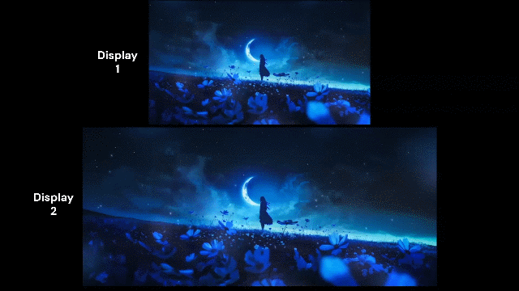

# Hide Taskbar Only on Desktop

A lightweight [Windhawk](https://windhawk.net/) mod that hides selected bottom-docked Windows taskbars when their corresponding display is showing only the desktop or a detected borderless fullscreen window, and reveals them again when an application or relevant Windows shell interaction requires the taskbar.

Each display is evaluated independently. An application on one display does not prevent a selected taskbar on another display from hiding when that display is in the desktop-only or detected fullscreen state.

Mod link to install it from Windhawk:  https://windhawk.net/mods/hide-taskbar-only-on-desktop

## Demo

### Multiple Displays



Each selected display is evaluated independently. An application can keep one display's taskbar visible while another display remains in the desktop-only state.

### Single Display


The taskbar hides when the display returns to the desktop and can be revealed by bottom-edge hover or supported keyboard and shell interactions.

## Features

- **Desktop-only taskbar hiding**
  - Hides a selected bottom-docked taskbar when its display has no relevant application window.
  - Keeps the taskbar visible while a relevant application is present.

- **Independent multi-monitor behavior**
  - Each selected display is evaluated separately.
  - Applications spanning multiple displays are considered on every display they intersect.
  - Maximized windows use the monitor assignment provided by Windows.

- **Borderless fullscreen detection**
  - Detects visible, monitor-sized, captionless, non-resizable application windows as fullscreen candidates.
  - Fullscreen ownership is tracked independently for each display.
  - Cached fullscreen ownership tolerates transient visibility or cloak changes while the owner still matches fullscreen geometry.
  - Fullscreen ownership is cleared when the owner no longer matches the display's fullscreen geometry.

- **Bottom-edge hover reveal**
  - Reveals a taskbar hidden by the mod when the cursor enters the configured bottom area.
  - The reveal area automatically accounts for the taskbar's current height and display DPI.
  - An additional configurable margin can be added above the taskbar.
  - Hover reveal applies to bottom-docked taskbars.
  - Hover dismissal uses a configurable delay.

- **Keyboard taskbar interaction**
  - Supports keyboard navigation such as **Win+T** and **Win+B**.
  - Tracks taskbar control focus separately from normal foreground-window state.
  - Keeps the taskbar visible briefly across transient focus transitions between taskbar controls.
  - Mouse-driven taskbar interaction is not treated as keyboard activation.

- **Windows shell interaction handling**
  - Relevant Windows shell surfaces are handled separately from normal application-window detection.
  - This includes supported Start menu, taskbar menus and popups, tray and notification overflow, Notification/Quick Settings, and Alt+Tab/task-switching UI.
  - Shell interaction can temporarily reveal a taskbar even while fullscreen ownership is active.

- **Direct taskbar control**
  - The mod uses layered-window transparency and click-through behavior to hide taskbars.
  - It does not intentionally enable or change Windows' native taskbar auto-hide setting.
  - The normal desktop work area is intentionally left unchanged.

- **Taskbar recovery and ownership tracking**
  - Taskbar ownership is tracked so the mod only restores taskbars that it actually modified.
  - Stale taskbar ownership can be detected after an unexpected tool-process termination.
  - Taskbar and display state are refreshed after taskbar recreation, Explorer changes, display changes, and settings changes.
  - A later tool-process startup can recover stale hidden-taskbar state.

- **Stable monitor interface-name mapping**
  - Display slots can optionally be pinned to specific physical monitors.
  - Mappings use Windows monitor interface names returned by `EnumDisplayDevicesW` with `EDD_GET_DEVICE_INTERFACE_NAME`.
  - Pinned monitors remain in their configured display slots while unpinned monitors fill the remaining slots in their current logical order.

## Settings

### Extra hover margin

Adds extra space above the automatically detected taskbar-height reveal zone.

The value is scaled for the display DPI, so the default `8` corresponds to 8 physical pixels at 100% scaling.

**Default:** `8 px`

### Auto-hide delay after hover

Controls how long the taskbar remains visible after the cursor leaves the bottom reveal area.

This delay applies only to hover-based hiding. Other state changes, such as returning to a desktop-only display state, are handled separately.

**Default:** `700 ms`

### Stable monitor interface names

Lets you pin a display slot to a specific physical monitor.

Each mapping contains:

- A display slot from **Display 1** through **Display 16**
- The monitor interface name for the physical display

Pinned monitors always use their configured display slots. Monitors that are not pinned fill the remaining slots in their current logical order.

If multiple mappings target the same slot or physical monitor, the last matching mapping wins.

To find the interface names on Windows, run this in PowerShell:

```powershell
Add-Type @'
using System;
using System.Runtime.InteropServices;

public static class DisplayDevices2 {
    [StructLayout(LayoutKind.Sequential, CharSet = CharSet.Unicode)]
    public struct DISPLAY_DEVICE {
        public int cb;
        [MarshalAs(UnmanagedType.ByValTStr, SizeConst = 32)] public string DeviceName;
        [MarshalAs(UnmanagedType.ByValTStr, SizeConst = 128)] public string DeviceString;
        public int StateFlags;
        [MarshalAs(UnmanagedType.ByValTStr, SizeConst = 128)] public string DeviceID;
        [MarshalAs(UnmanagedType.ByValTStr, SizeConst = 128)] public string DeviceKey;
    }

    [DllImport("user32.dll", CharSet = CharSet.Unicode, EntryPoint = "EnumDisplayDevicesW")]
    public static extern bool EnumDisplayDevices(
        string lpDevice,
        uint iDevNum,
        ref DISPLAY_DEVICE lpDisplayDevice,
        uint dwFlags);
}
'@

for ($i = 1; $i -le 16; $i++) {
    $m = New-Object DisplayDevices2+DISPLAY_DEVICE
    $m.cb = [Runtime.InteropServices.Marshal]::SizeOf($m)

    if ([DisplayDevices2]::EnumDisplayDevices("\\.\DISPLAY$i", 0, [ref]$m, 1)) {
        Write-Host "Display $i : $($m.DeviceString)"
        Write-Host "Interface : $($m.DeviceID)"
        Write-Host ""
    }
}
```

Paste the full value shown after **Interface :** into the mapping for the display slot you want to attach to that physical monitor.

The mod intentionally supports up to 16 fixed logical display slots.

### Taskbars to reveal on hover

Controls which display slots allow bottom-edge hover reveal.

Hover reveal is available only for bottom-docked taskbars.

### Taskbars to hide on desktop

Controls which display slots participate in desktop-based taskbar hiding.

Displays can be selected individually or configured to apply to all displays. Stable monitor interface names can optionally be used to keep a display slot attached to the same physical monitor when the logical display order changes.

## Difference from `taskbar-fade`

`taskbar-fade` and this mod both use layered taskbar transparency and can reveal the taskbar from the bottom edge, so they overlap in mechanism.

This mod has a different primary state model:

> **Desktop-only state is evaluated independently for each display, and the taskbar becomes immediately eligible for hiding when that display has no relevant application, subject to explicit hover, shell, or keyboard reveals.**

It also provides per-display fullscreen tracking, shell-surface handling, keyboard taskbar interaction, minimize-transition handling, and recovery logic around that state model.

The two mods should not be used on the same taskbar because both modify the taskbar window's transparency/style state.

## How It Works

The main state-management logic runs in a dedicated Windhawk tool process. A small Explorer-side component handles the narrow taskbar visibility transition used to prevent secondary-taskbar flashing.

For each selected display, the mod:

1. Discovers the taskbar associated with the display.
2. Enumerates relevant top-level windows and associates them with displays.
3. Determines whether a relevant application window is present.
4. Checks for detected fullscreen ownership on the display.
5. Accounts for supported Windows shell surfaces.
6. Checks hover and keyboard taskbar interaction state.
7. Applies the resulting visibility state to that display's taskbar.

Fullscreen tracking uses foreground, move/size, owner-location, and fullscreen validation events. A periodic safety refresh provides a recovery path for transitions that do not produce a single reliable event.

Taskbar control focus is tracked through an out-of-context accessibility focus hook so keyboard navigation such as **Win+T** and **Win+B** can reveal a taskbar even when Windows has not yet made that taskbar the foreground window.

The hidden taskbar is made transparent and click-through rather than being switched to Windows' native auto-hide mode.

## Multi-Monitor Example

Consider two displays:

1. An application is open on display 1.
2. Display 2 is showing only the desktop.
3. The selected taskbar on display 1 remains visible.
4. The selected taskbar on display 2 hides.
5. Moving the cursor into display 2's configured bottom-edge area reveals its taskbar.
6. Moving the cursor away starts the configured hover-dismiss delay.
7. Opening an application on display 2 keeps its taskbar visible.

The same logic is applied independently to every selected display.

A detected fullscreen window can also make a display eligible for hiding. During fullscreen detection, bottom-edge hover does not reveal the taskbar; supported keyboard navigation such as **Win+T** or **Win+B**, or supported shell interaction such as **Start**, can still provide access.

## Windows Shell Interactions

The mod favors keeping the taskbar available when supported Windows shell UI is active.

Supported shell handling includes relevant:

- Start menu surfaces
- Taskbar menus and popups
- Tray and notification overflow
- Notification and Quick Settings surfaces
- Alt+Tab and related task-switching UI
- Desktop shell surfaces

Shell surfaces are identified using relevant window classes together with the owning Windows shell process where required.

Windows shell implementation details can change between Windows releases, so additional classes or processes may need to be added for future Windows versions.

## Explorer Integration

The Explorer-side component provides a narrow protection against a specific secondary-taskbar transition.

When a secondary taskbar has been hidden by this mod, Explorer may independently attempt to show it with `ShowWindow(..., SW_SHOWNA)`. The mod suppresses that specific transition only while the taskbar is still owned by a running instance of the dedicated tool process.

The protection:

- Applies only to the secondary taskbar.
- Applies only to a taskbar marked as hidden by this mod.
- Applies only to the `SW_SHOWNA` transition.
- Allows unrelated Explorer `ShowWindow` calls to proceed normally.

This prevents a brief secondary-taskbar flash without broadly intercepting Explorer window visibility operations.

### Failure Recovery

Taskbar ownership is associated with the dedicated tool process.

If that process terminates unexpectedly, stale ownership can be detected and the affected taskbar can be recovered instead of remaining permanently blocked by an old mod instance.

If the taskbar window itself no longer exists, restarting Windows Explorer recreates it.

## Display and Explorer Changes

The mod refreshes taskbar and display state when relevant changes occur, including:

- Taskbar recreation
- Explorer-related state changes
- Display topology changes
- Monitor addition or removal
- Display configuration changes
- Windhawk setting changes

Taskbars are rediscovered rather than assuming that their window handles remain unchanged.

## Performance

The main application/display scan runs in the dedicated tool process rather than performing the full scan inside Explorer.

The mod uses:

- A dedicated worker thread for state management
- Event-driven refreshes for relevant changes
- A periodic safety refresh for missed or unusual transitions
- A lightweight cursor-sampling thread for hover detection
- Adaptive cursor sampling when hover tracking is not required
- One-shot timers for hover dismissal, fullscreen validation, and keyboard taskbar release
- A narrow Explorer-side visibility hook for secondary-taskbar flash prevention

## Limitations

- **Recovery:** If the dedicated tool process terminates unexpectedly while a taskbar is hidden, disable and re-enable this mod in Windhawk or restart Windows Explorer to restore it. A later tool-process startup also performs ownership recovery.
- Desktop-only hiding and hover reveal apply to bottom-docked taskbars.
- The hidden taskbar remains part of the normal work area and is click-through.
- If a taskbar's monitor cannot be resolved during a state refresh, the mod fails safe by leaving that taskbar visible.
- Flashing taskbar buttons and tray notifications are not visible while the taskbar is transparent.
- Native Windows taskbar auto-hide remains separate from this mod; when it is enabled, this mod does not take over that taskbar.
- Other taskbar transparency/style mods can conflict when they modify the same taskbar.
- A visible, monitor-sized, captionless, non-resizable application may be treated as fullscreen.
- Cached fullscreen ownership can remain active through transient visibility or cloak changes while the owner still matches fullscreen geometry.
- During fullscreen detection, bottom-edge mouse hover does not reveal the taskbar; use **Win+T**, **Win+B**, or **Start** to access it.
- Windows shell classes and processes can change between Windows releases, so shell-interaction detection may require updates for future Windows versions.
- The mod intentionally supports up to 16 display slots.
- The mod is designed specifically around Windows Explorer/taskbar behavior and is not intended to be a general-purpose taskbar customization framework.

## Requirements

- Windows 10 or Windows 11
- [Windhawk](https://windhawk.net/)
- Windows Explorer shell (`explorer.exe`)

## Installation

### Install through Windhawk

1. Install [Windhawk](https://windhawk.net/).
2. Open Windhawk.
3. Go to **Home → Create a new mod**.
4. Paste the contents of `hide-taskbar-only-on-desktop.wh.cpp`.
5. Compile the mod.
6. Enable it.
7. Configure the display, hover, and optional stable-monitor settings to your preference.

### Manual source installation

Clone or download this repository and use the `.wh.cpp` source file with Windhawk.

## Recommended Settings

The defaults are intended to provide a practical desktop-only taskbar experience:

```text
Extra hover margin:       8 px
Auto-hide delay:          700 ms
Hover reveal:             All displays
Hide on desktop:          All displays
Stable monitor mapping:   Optional
```

You can adjust these values from the Windhawk mod settings.

## Goal

The goal is a specific behavior:

> **Hide the taskbar when its display is showing only the desktop.**

The mod is not intended to replace Windows' native taskbar auto-hide or to be a general-purpose taskbar customization framework.

It is intended for users who want:

- A normal taskbar while working in applications
- A clean desktop when a display is idle
- Per-display behavior across multiple monitors
- Optional bottom-edge hover reveal
- Borderless fullscreen-aware taskbar hiding
- Keyboard and shell-aware taskbar visibility
- Optional stable physical-monitor mapping
- Windows' native auto-hide setting left untouched

## Author

**Sahil Dashoni**

GitHub: [@Sahil-Dashoni](https://github.com/Sahil-Dashoni)
